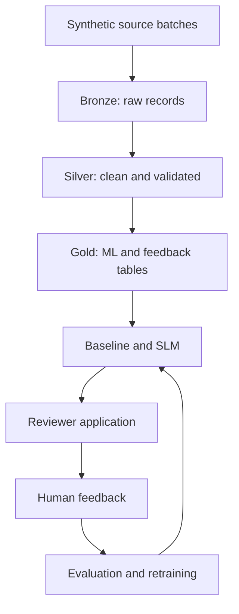

# Work Order AI Data Flywheel

[](https://github.com/terziceh/workorder-ai-flywheel/actions/workflows/ci.yml)

**Project board:** [Work Order AI Data Flywheel](https://github.com/users/terziceh/projects/7)

An end-to-end tutorial for building a Databricks lakehouse, small language model (SLM) work-code recommendation engine, human-review application, and continuous feedback flywheel using independently generated facilities work orders.

> [!IMPORTANT]
> This independent portfolio project uses exclusively synthetic data and a fictional work-code taxonomy. It contains no employer records, identifiers, schemas, screenshots, source code, architecture, or confidential business logic.

## What this repository teaches

This repository documents the complete build—not only the final model:

1. Define the business problem and success criteria.
2. Manage delivery with GitHub Projects, issues, branches, pull requests, and milestones.
3. Generate reproducible synthetic facilities data.
4. Ingest source batches into a Databricks Bronze layer.
5. Clean and validate work orders in Silver.
6. Create training, inference, feedback, and monitoring tables in Gold.
7. Establish a TF-IDF recommendation baseline.
8. Build and evaluate an SLM recommendation layer.
9. Capture human accept, correct, and flag decisions.
10. Convert approved feedback into evaluation and retraining data.
11. Build the reviewer application.
12. Add application CI/CD only after the model and app are stable.

## Business problem

Facilities organizations produce large volumes of text-heavy work orders. Historical work codes can be missing, inconsistent, or incorrect, weakening operational reporting, asset analysis, and future model training. Manual review is slow, while fully automated classification can be unsafe when labels overlap or descriptions are ambiguous.

The proposed solution provides ranked work-code recommendations while keeping a human reviewer in control. Reviewer actions are preserved as evaluation evidence and potential retraining data.

## Target architecture



## Build walkthrough

| Step | Chapter | Planned outcome |
|---:|---|---|
| 0 | [Business problem](docs/00_business_problem.md) | Users, risks, scope, and success metrics |
| 1 | [GitHub project setup](docs/01_github_project_setup.md) | Board, milestones, issues, branches, PRs, and current CI |
| 2 | [Environment setup](docs/02_environment_setup.md) | Reproducible local, GitHub, and Databricks configuration |
| 3 | [Synthetic data](docs/03_synthetic_data.md) | Safe work orders with realistic quality issues |
| 4 | [Bronze ingestion](docs/04_bronze_ingestion.md) | Raw, traceable, idempotent Delta ingestion |
| 5 | [Silver transformations](docs/05_silver_transformations.md) | Standardized text, types, labels, and quality flags |
| 6 | [Gold data products](docs/06_gold_data_products.md) | Training, inference, feedback, evaluation, and monitoring tables |
| 7 | [Baseline model](docs/07_baseline_model.md) | Leakage-resistant Top-1/Top-3 benchmark |
| 8 | [SLM recommendation engine](docs/08_slm_recommendation_engine.md) | Context-aware, structured recommendations |
| 9 | [Feedback flywheel](docs/09_feedback_flywheel.md) | Reviewer actions converted into governed learning data |
| 10 | [Reviewer application](docs/10_reviewer_application.md) | Accept, correct, and flag workflow |
| 11 | [CI/CD and deployment](docs/11_ci_cd_and_deployment.md) | Tested release and deployment workflow after model completion |
| 12 | [Results and lessons](docs/12_results_and_lessons.md) | Metrics, problems, resolutions, limitations, and next steps |

## Current status

**Milestone:** `v0.1 — Documentation and Project Setup`

- [x] Repository foundation
- [x] Public privacy boundary
- [x] Tutorial documentation structure
- [x] Synthetic-data generator foundation
- [x] Unit and integration test foundation
- [x] Repository CI workflow
- [x] Publish GitHub repository and Project board
- [ ] Recreate the existing Bronze design using synthetic data
- [ ] Validate Bronze ingestion through CI fixtures

## Repository organization

```text
.
├── .github/             Issue templates, PR template, and current CI
├── configs/             Non-sensitive configuration
├── docs/                Numbered build tutorial and reference documentation
├── notebooks/           Exploration and communication only
├── sample_data/         Small generated examples only
├── scripts/             Developer entry points
├── src/workorder_ai/    Reusable pipeline and model code
├── tests/               Unit, integration, and later data/model tests
├── CONTRIBUTING.md
├── Makefile
├── pyproject.toml
└── README.md
```

## Quick start

Requires Python 3.11 or newer.

```bash
python -m venv .venv
source .venv/bin/activate  # Windows PowerShell: .venv\Scripts\Activate.ps1
python -m pip install -e ".[dev]"
make generate-sample
make check
```

## Documentation pattern

Every technical chapter documents:

- Objective and rationale
- Inputs and table grain
- Implementation
- Validation and tests
- Problems encountered
- Resolution and tradeoffs
- Outputs
- Related GitHub issues and pull requests
- Next dependency

This makes the repository both a project case study and a reproducible tutorial.

## Current GitHub Actions scope

The initial CI workflow checks formatting, linting, tests, and synthetic-data generation. Model validation will be added with the baseline milestone. Application build and deployment workflows are intentionally deferred until the reviewer application exists.

## Privacy rule

All public work orders, facilities, assets, labels, mappings, and quality problems must be created independently for this repository. See [Security and Privacy](docs/security_and_privacy.md).

## License

Released under the [MIT License](LICENSE).
