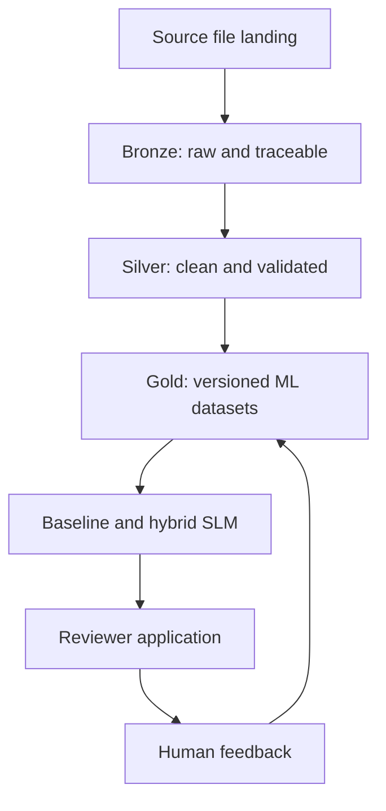

# Work Order AI Data Flywheel

[](https://github.com/terziceh/workorder-ai-flywheel/actions/workflows/ci.yml)

**Project board:** [Work Order AI Data Flywheel](https://github.com/users/terziceh/projects/7)

An end-to-end build log and tutorial for developing a Databricks lakehouse, work-code recommendation model, and human-review data flywheel.

> [!IMPORTANT]
> The system may be developed and validated privately with authorized operational data. No source dataset is published. Every record, identifier, taxonomy example, screenshot preview, and reproducible result committed to this public repository must be synthetic, fictionalized, sanitized, or safely generalized.

## What this repository demonstrates

This repository follows the actual engineering dependency chain:

1. Define the business problem and privacy boundary.
2. Manage the work through GitHub Projects and implementation issues.
3. Land the source file in a governed Databricks Unity Catalog volume.
4. Build a traceable Bronze Delta ingestion notebook.
5. Profile and validate Bronze before downstream use.
6. Clean, standardize, and quality-check records in Silver.
7. Build versioned Gold training, inference, and evaluation datasets.
8. Analyze historical labels and define a defensible modeling strategy.
9. Train and evaluate a TF-IDF recommendation baseline.
10. Build and validate a hybrid SLM recommendation model.
11. Connect the approved model to a reviewer application and feedback flywheel.
12. Add application deployment automation only after the model and app are stable.

## Business problem

Facilities organizations produce large volumes of text-heavy work orders. Historical work codes can be missing, inconsistent, or incorrect, weakening operational reporting, asset analysis, and future model training. Manual review is slow, while fully automated classification can be unsafe when labels overlap or descriptions are ambiguous.

The proposed solution provides ranked work-code recommendations while keeping a human reviewer in control. Reviewer actions are preserved as evaluation evidence and potential retraining data.

## Target architecture



## Current implementation plan

| Issue | Deliverable | Completion evidence |
|---:|---|---|
| [#2](https://github.com/terziceh/workorder-ai-flywheel/issues/2) | Load source data into Databricks | Safe screenshots, landing-path explanation, and read verification |
| [#3](https://github.com/terziceh/workorder-ai-flywheel/issues/3) | Build Bronze tables and ingestion notebook | Delta write, metadata, reconciliation, and rerun test |
| [#4](https://github.com/terziceh/workorder-ai-flywheel/issues/4) | Profile and validate Bronze | Repeatable quality report and documented fixes |
| [#5](https://github.com/terziceh/workorder-ai-flywheel/issues/5) | Build the Silver pipeline | Clean records, quality exceptions, tests, and reconciliation |
| [#6](https://github.com/terziceh/workorder-ai-flywheel/issues/6) | Build Gold ML datasets | Reproducible train, validation, test, inference, and evaluation outputs |
| [#7](https://github.com/terziceh/workorder-ai-flywheel/issues/7) | Analyze labels and modeling strategy | Label-quality findings, taxonomy decisions, and evaluation plan |
| [#8](https://github.com/terziceh/workorder-ai-flywheel/issues/8) | Train the TF-IDF baseline | MLflow run, Top-k metrics, error analysis, and saved pipeline |
| [#9](https://github.com/terziceh/workorder-ai-flywheel/issues/9) | Build the hybrid SLM model | Baseline comparison, structured inference, fallbacks, and model card |

## Tutorial chapters

| Chapter | Purpose |
|---|---|
| [Business problem](docs/00_business_problem.md) | Users, risks, scope, and success metrics |
| [GitHub project setup](docs/01_github_project_setup.md) | Board, issues, branches, pull requests, and current CI |
| [Databricks and source setup](docs/02_environment_setup.md) | Governed file landing and safe screenshot walkthrough |
| [Public synthetic companion data](docs/03_synthetic_data.md) | Reproducible examples without distributing the source dataset |
| [Bronze ingestion](docs/04_bronze_ingestion.md) | Parameterized notebook, Delta tables, metadata, and validation |
| [Silver transformations](docs/05_silver_transformations.md) | Cleaning, standardization, quality flags, and exceptions |
| [Gold data products](docs/06_gold_data_products.md) | Versioned ML datasets and leakage-resistant splits |
| [Baseline model](docs/07_baseline_model.md) | Label analysis and TF-IDF benchmark |
| [SLM recommendation engine](docs/08_slm_recommendation_engine.md) | Constrained hybrid recommendations and evaluation |
| [Feedback flywheel](docs/09_feedback_flywheel.md) | Governed reviewer actions and future learning data |
| [Reviewer application](docs/10_reviewer_application.md) | Accept, correct, flag, and abstain workflow |
| [CI/CD and deployment](docs/11_ci_cd_and_deployment.md) | Release workflow after model and application stability |
| [Results and lessons](docs/12_results_and_lessons.md) | Metrics, problems, fixes, limitations, and next steps |

## Current status

**Current issue:** [#2 — Load the source data into Databricks and document the setup](https://github.com/terziceh/workorder-ai-flywheel/issues/2)

- [x] Repository foundation and public Project board
- [x] Privacy boundary
- [x] Documentation and issue structure
- [x] Repository CI
- [ ] Complete the sanitized Databricks source-landing walkthrough
- [ ] Build and validate the Bronze ingestion notebook
- [ ] Continue through Silver, Gold, and modeling

## Repository organization

```text
.
├── .github/             Issue templates, PR template, and current CI
├── configs/             Non-sensitive configuration
├── docs/                Build tutorial and engineering decisions
├── notebooks/           Exploration and communication only
├── sample_data/         Small generated examples only
├── scripts/             Developer entry points
├── src/workorder_ai/    Reusable pipeline and model code
├── tests/               Unit, integration, data, and model tests
├── CONTRIBUTING.md
├── Makefile
├── pyproject.toml
└── README.md
```

## Evidence standard

Every technical stage should include:

- Objective, input, output, and table grain
- Implementation or notebook walkthrough
- Validation and reconciliation
- Problems, root causes, fixes, and tradeoffs
- Tests and reproducibility instructions
- Sanitized screenshots or synthetic output
- Related issue, commit, or pull request
- Known limitations and next dependency

## Privacy and screenshot rules

Public screenshots must not expose real records, employer or employee identifiers, email addresses, workspace URLs, credentials, internal storage paths, or unauthorized operational metrics. Screenshots are reviewed and cropped or redacted before publication. Example rows and public model demonstrations use synthetic data.

See [Security and Privacy](docs/security_and_privacy.md).

## GitHub Actions scope

Current CI checks the public Python package, tests, and synthetic-data generation. Data and model checks will be added when their implementation reaches the repository. Application build and deployment workflows remain intentionally deferred until the reviewer application exists.

## License

Released under the [MIT License](LICENSE).
