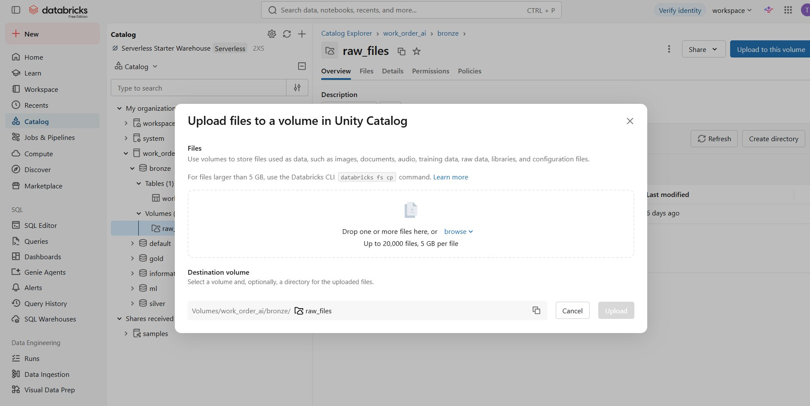
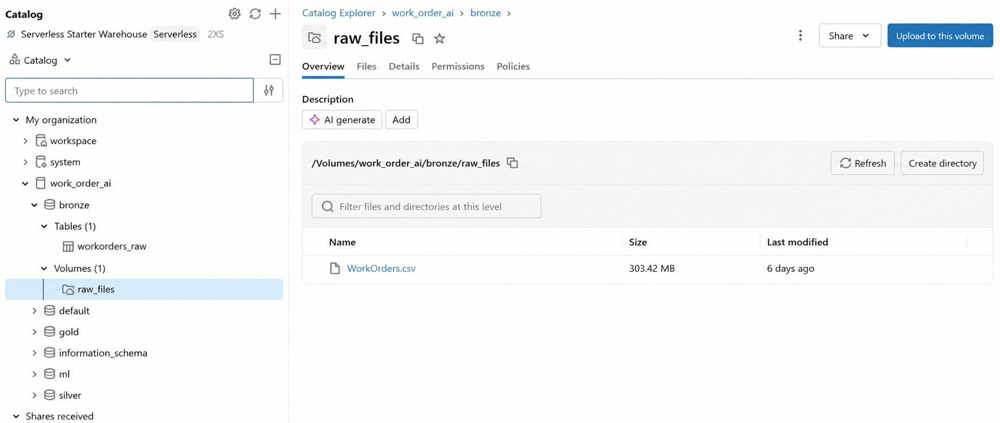

# 02 — Databricks Setup and Source-File Landing

Related issue: [#2 — Load the source data into Databricks and document the setup](https://github.com/terziceh/workorder-ai-flywheel/issues/2)

## Objective

Place the source file in a governed Databricks landing location, verify that it is readable, and document the process without publishing the dataset.

The private implementation can use authorized operational data. Public instructions, screenshots, paths, examples, and downloadable files must remain synthetic, sanitized, or safely generalized.

## Prerequisites

- Access to a Databricks workspace
- Unity Catalog enabled
- Permission to create or use a catalog, schema, and volume
- An approved source file for the private implementation
- A generated sample file for public reproduction
- No secrets stored in notebooks or GitHub

## Landing design

The tutorial uses this generalized structure:

```text
catalog: work_order_ai
schema:  bronze
volume:  raw_files
path:    /Volumes/work_order_ai/bronze/raw_files/
```

A Unity Catalog volume provides a governed location for source files before they are read by the Bronze ingestion notebook. Landing the file separately from table creation preserves the original input and makes ingestion easier to rerun and audit.

## Walkthrough

### 1. Open Catalog Explorer

Open the intended catalog and Bronze schema, then select the `raw_files` volume.

### 2. Upload the source file

Select **Upload to this volume**, choose the approved source file, verify the destination volume, and upload it.



> **Figure 1 — Opening the Unity Catalog upload workflow.** The destination is the `raw_files` volume inside the Bronze schema. At this stage, Databricks stores the source file but has not yet transformed it into a Delta table.

Screenshot evidence for this step must show the Databricks workflow without displaying records, credentials, employer identifiers, or private browser information.

### 3. Confirm the landed file

Open the volume’s **Files** view and verify that the expected file appears.



> **Figure 2 — Confirming the landed source file.** Databricks displays the uploaded CSV inside the governed `raw_files` volume. The screenshot is cropped to exclude ownership information and other private metadata. The public reproduction uses a synthetic file even when the private implementation uses an authorized operational source.

### 4. Verify readability

Use a small notebook cell to confirm that Databricks can access the landed file. Do not publish a preview of real rows.

```python
source_path = "/Volumes/work_order_ai/bronze/raw_files/synthetic_workorders.csv"

source_df = spark.read.option("header", True).option("inferSchema", False).csv(source_path)

print(source_df.columns)
print(source_df.limit(0).count())
```

The public example deliberately references `synthetic_workorders.csv`. Private filenames and paths should not be copied into GitHub.

## Evidence checklist

- [ ] Catalog, schema, volume, and purpose are explained
- [ ] Upload interface is documented
- [ ] Landed-file confirmation is documented
- [ ] A safe read-verification example is included
- [ ] Screenshots contain no real rows or employer identifiers
- [ ] Problems and fixes are recorded
- [ ] The source file itself is not committed

## Problems and resolutions

Use this format for each genuine implementation issue:

> **Problem → Impact → Root cause → Resolution → Validation → Remaining limitation**

Examples may include file-size limits, incorrect destinations, permission errors, CSV parsing options, or unexpected delimiters. Public examples must omit sensitive paths and values.

## Output

A source file that is accessible to the private Databricks workspace and a public tutorial that can be reproduced with independently generated sample data.

## Next step

Build the Bronze Delta tables and parameterized ingestion notebook in [Issue #3](https://github.com/terziceh/workorder-ai-flywheel/issues/3).
